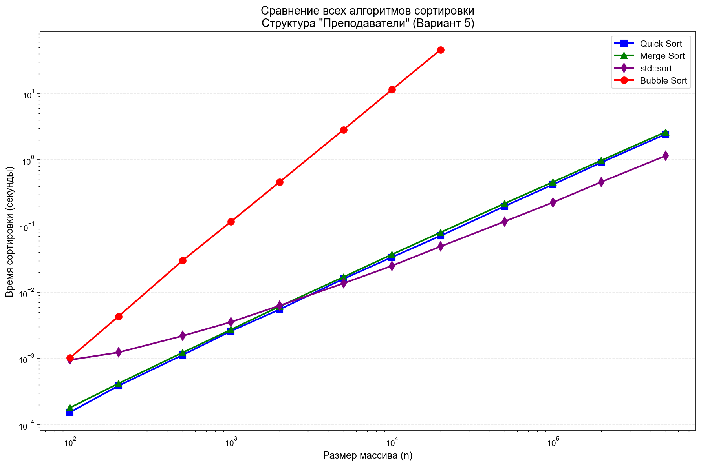

# Лабораторная работа №1: Сравнение алгоритмов сортировки

**Вариант 5**
- **Структура данных:** Преподаватели (ФИО, факультет, учёное звание, учёная степень)
- **Алгоритмы сортировки:** Пузырьковая, быстрая, слиянием

## Результаты

Графики зависимости времени от размера массива:



## Выводы

- Пузырьковая сортировка применима только для n < 1000
- Быстрая сортировка хороша для массивов до 100000 элементов
- std::sort — оптимальный выбор для любых размеров

## Запуск

```bash
cd lab1
python3 plot.py   # для построения графиков
